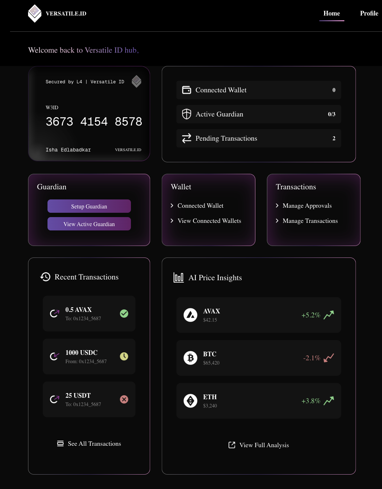

# Web3 Wallet Dashboard

A modern, responsive Web3 identity management dashboard built with Next.js 16 and Tailwind CSS. This project showcases a clean, dark-themed UI for managing digital identities, crypto wallets, and transactions.

## Live Demo
[Web3 Wallet Dashboard](https://versatile-1.vercel.app/) 

## Preview



## Built With

- **Next.js 16** - React framework for production
- **React 19** - Latest React version
- **Tailwind CSS 4** - Utility-first CSS framework
- **TypeScript** - Type safety and better developer experience

## Getting Started

### Prerequisites

- Node.js 20 installed
- npm or yarn package manager

### Installation

1. Clone the repository
```bash
git clone https://github.com/yourusername/web3-wallet-dashboard.git
cd web3-wallet-dashboard
```

2. Install dependencies
```bash
npm install
```

3. Run the development server
```bash
npm run dev
```

4. Open [http://localhost:3000](http://localhost:3000) in your browser


## Acknowledgments

- Design inspired by modern Web3 applications

---

**Note:** This is a static UI implementation without backend functionality. It demonstrates front-end development skills including responsive design, modern React patterns, and clean component architecture.
